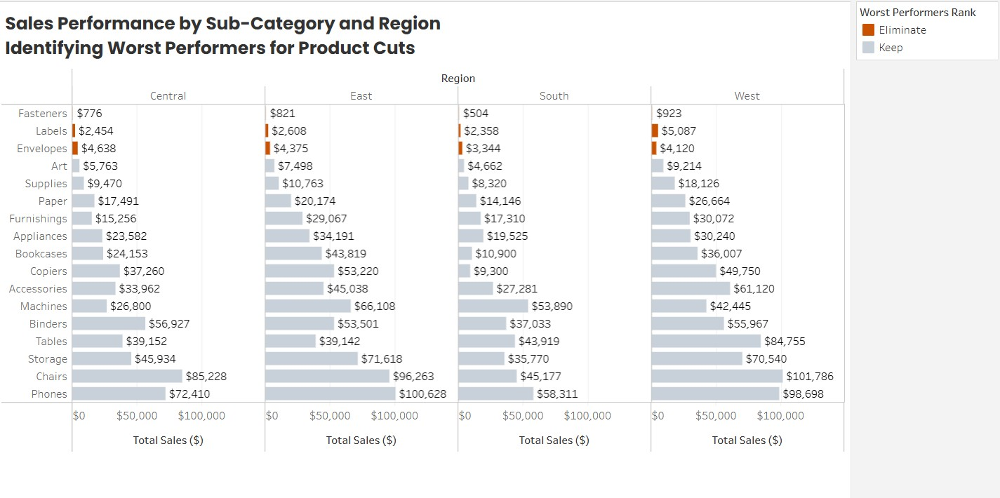

# ACME Superstore: Product Performance Analysis & Optimization

A data-driven visualization project identifying underperforming products for portfolio optimization.

## 🎯 Quick Overview

**Problem:** Which products should ACME Superstore eliminate to optimize inventory and margin?

**Solution:** Interactive Tableau visualization + design principle analysis revealing consistent underperformers across all regions

**Impact:** Identified 3 products generating <1% of revenue with disproportionate overhead; enables $26K-$104K annual margin improvement

## 📊 Key Findings

Three worst-performing sub-categories (overall):
1. **Fasteners:** $3,024 (94% below average)
2. **Labels:** $12,507 (75% below average)
3. **Envelopes:** $16,477 (68% below average)

All three rank in bottom 3 across all regions (Central, East, South, West)

## 🎨 Design Principles Applied

- **Pre-Attentive Attributes:** Red/Orange color for worst performers
- **Gestalt Principles:** Small multiples grouped by region
- **Cognitive Load:** Single metric (Sales only)
- **Static Format:** Focused recommendation, not exploratory dashboard

## 📈 Business Impact

- $31K in low-margin products identified
- 225 sq ft of premium shelf space freed
- $26K-$104K annual margin improvement projected
- 90-day implementation timeline

## 🔗 Links

- **Live Tableau Dashboard:** [https://public.tableau.com/views/ACME_SuperstoreWorst_Performers/WorstPerformersbyRegion](https://public.tableau.com/views/ACME_Superstore_Worst_Performers/WorstPerformersbyRegion?:language=en-US&:sid=&:redirect=auth&:display_count=n&:origin=viz_share_link)
- **Full Case Study:** See CASE_STUDY.md

## 📁 Files Included

- `worst_performers_visualization.png` - Main visualization
- `PORTFOLIO_CASE_STUDY.md` - Full project narrative
- `PORTFOLIO_DESIGN_PRINCIPLES.md` - Design thinking breakdown
- `PORTFOLIO_BUSINESS_IMPACT.md` - ROI analysis
- `PORTFOLIO_INTERVIEW_TALKING_POINTS.md` - Interview prep

## 💼 Skills Demonstrated

✅ Data Analysis (9,994 transactions)
✅ Tableau Visualization
✅ Design Principles (Pre-attentive, Gestalt, Cognitive Load)
✅ Business Communication
✅ Impact Quantification

---

**Created:** August 2026
**Author:** [Alessandro Branco]
**LinkedIn:** [Your LinkedIn URL]
